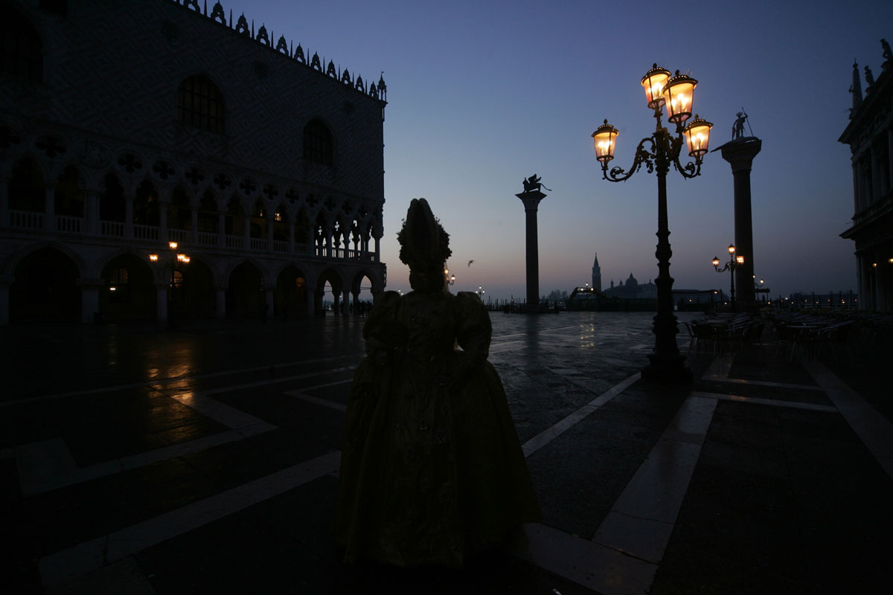

# PyTorch Exposure Fusion

This is an unofficial Python implementation of the [Mertens et. al Exposure Fusion](https://www.tommertens.com/exposure_fusion/index.html) method using PyTorch. The method combines multiple images with different exposures to create a single image with an extended dynamic range. This implementation is 100% PyTorch-based, making it compatible with GPU acceleration for faster processing. Additionally, it should supports gradient backpropagation, enabling seamless integration into deep learning pipelines.

## Illustration

|  |  |  |  |
|:---:|:---:|:---:|:---:
| **Input Image A** | **Input Image B** | **Input Image C** | **Exposure Fusion Result** |

## Requirements
- PyTorch

## Usage
```python
import torch
from exposure_fusion import exposure_fusion


# Load your input images as PyTorch tensors
# Replace ... with your image tensor, of size [N, C, H, W], where
# N is the number of frames, C the color channels, H the height and W the width
burst = torch.tensor(...)

# Perform exposure fusion
result = exposure_fusion(burst)

# Use the resulting tensor as needed (e.g., display or further processing)
```

## Example

The `example.py` script contains an example. It may require a few more modules to read and save the images. Feel free to try it on the few bursts provided in the `data` folder.
```python
import os
import glob
import torch as th
import cv2
import matplotlib.pyplot as plt
from pathlib import Path

from exposure_fusion import exposure_fusion

# Read image burst
burst_path = Path("data/mask")

im_path_list = glob.glob(os.path.join(burst_path.as_posix(), '*.jpg'))
im_path_list += glob.glob(os.path.join(burst_path.as_posix(), '*.png'))
assert len(im_path_list) != 0, 'At least one .jpg or .png file must be present in the burst folder.'

burst = []
for im_path in im_path_list:
    burst.append(
        cv2.cvtColor(
            cv2.imread(im_path, cv2.IMREAD_UNCHANGED),
            cv2.COLOR_BGR2RGB)
        ) # flag to keep the same bit depth as original

# Normalise the burst between 0 and 1
burst = th.Tensor(burst)/255
burst = burst.movedim(-1, 1) # batch, channel, H, W format


out = exposure_fusion(burst)

out = out.clamp(0, 1)
out = out.movedim(0, -1).cpu().numpy() # [H, W, C] format for matplotlib
plt.imsave("out/result.png", out, vmin=0, vmax=1)
```

## Implementation Divergence

The original implementation uses 5x5 gaussian filters for downsampling and upsampling the stages of the gaussian pyramid. I used instead a 3x3 binomial filter. This modification is chosen for its efficiency, speed, and the observation that it does not significantly seem to impact the quality of the results. 

# Troubleshooting

If you encounter any issues, bugs, or have questions about the PyTorch Exposure Fusion implementation, feel free to reach out for assistance. You can:

- **Open an Issue:** If you believe you've identified a bug or have a feature request, please open an issue on the GitHub repository.

- **Email:** For private inquiries or specific concerns, you can reach me via email at [jamy.lafenetre@ens-paris-saclay.fr](mailto:jamy.lafenetre@ens-paris-saclay.fr).

I appreciate your feedback and will do my best to address any concerns promptly.

## License

This implementation is provided under the MIT License

